## Executive Summary

The introduction of Nemoclaw provides organizations with a platform similar to the proprietary systems that AI service providers like Claude and OpenAI charge access to.

The technology benefits are:

- Nemoclaw can be configured to an organization's needs, such as security requirements, tool use, industry data policies, and custom features
- Nemoclaw has the backing of NVIDIA, a multinational organization with a good reputation and global influence

The technology drawbacks are:

- Nemoclaw requires technical expertise to set up and manage
- There is not currently a lot of available documentation on how to build enterprise grade systems using Nemoclaw

Nemoclaw can integrate into an organization's overall AI strategy by:

a) Mitigating the risk of employees uploading company data to ChatGPT free tier, to be used for training
b) Being able to provide curated industry-relevant responses to increase efficiency
c) Reducing the impact of employee turnover, because even if the employee leaves, their agent (expertise) stays in the organization

This document outlines:

1. How to install and set up Nemoclaw to begin using the technology
2. Instructions to implement a simple Nemoclaw business intelligence platform

## Background

### Service Providers

Major AI service providers, such as Claude and ChatGPT, differ from locally run models by providing high-level reasoning capability at-scale. Open-source LLM platforms like vLLM, Ollama, or HuggingFace libraries, cannot provide that same level of reasoning capability without this sophisticated orchestration layer.

To do this, they structured their platform infrastructure to produce the following capabilities:

- Persistent memory across chats
- Enterprise-level authentication and privacy layers
- Agent orchestration, being able to route prompts to specific expert agents and aggregate the output
- Tool use, such as crawling websites, parsing images, working in specific file formats such as word and excel, or producing linted code

These proprietary orchestration systems provide users a cohesive user experience that hides all of this complicated technology under the hood. However, this forces organizations to pay per token to access this high-level reasoning capability and established an unrealistic hurdle to developing similar capabilities internally.

### Openclaw

Similar to how GNU-Linux open-sourced operating systems, where individuals and organizations could contribute to a project that anyone can install, modify, and enhance free-of-charge, Openclaw open-sourced an LLM infrastructure for creating dynamic agents through community generated plugins, scripts, and configurations. This got individuals and professionals alike, excited and tinkering with the technology at a scale not seen before.

### Nemoclaw

The existing Openclaw project lacked two main requirements to be introduced into an enterprise setting:

1. Enterprise-level security & access policies
2. An organization, like NVIDIA, to provide credibility that the project will be maintained into the foreseeable future

Nemoclaw resolves these two barriers to adoption by providing strict security settings through Openshell, a part of NVIDIA's AI Agent toolkit.

### Openshell

Openshell fills the security gap by providing the following features:

a) Kernel-level egress flagging and approval
b) Credential injection layer, so the agent never actually sees your password or API key
c) Strict policy configurations, requiring a specific binary inside the sandbox to be approved for a specific communication protocol to a specific destination address
d) The ability to integrate easily with local LLM inference platforms, like vLLM and NIM-local
e) Strict filesystem access controls where the agent cannot itself modify its own configuration

## Business Case

For organizations, Nemoclaw may enhance operations through the following opportunities:

**Managing Risk** - Your employees are using AI anyways, and they are probably uploading all of your confidential information to it on a daily basis. By providing them with a controlled alternative, as an organization, you may be able to mitigate this data leakage.

**Context-Driven Responses** - By providing a Nemoclaw agent access to internal process documentation, the responses that you receive will be more contextually specific to your industry and business.

**Reduced Impact of Employee Turnover** - Currently, an employee's email account will be deactivated and documents erased. Anyways, these documents would have been organized in such a way where you would require a deep understanding of the role and project to follow along. By tying a personalized agent to that role, even if the human leaves the role, the "tribal knowledge" built over time from historical data and "battle-tested" context remains with the organization.

Overall, since Openclaw is an emerging project, we haven't seen this play out yet at an enterprise scale. This makes it difficult to quantify the impact of these opportunities to the organization. Instead, these strategic considerations should be a part of an organization's complete AI strategy and tied to specific key performance indicators of value for that specific industry, such as time-to-market, turnover rate, or project risk level.

## Nemoclaw Concepts

### Overview

Nemoclaw coordinates the communication and security policy enforcement across multiple systems on the host machine and on connected services. These systems coordinate with each other to provide an extensible orchestration layer.

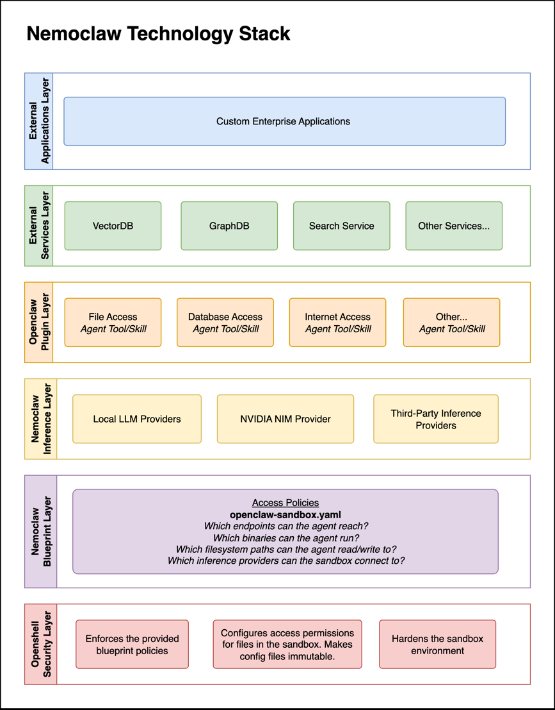

### Systems Overview

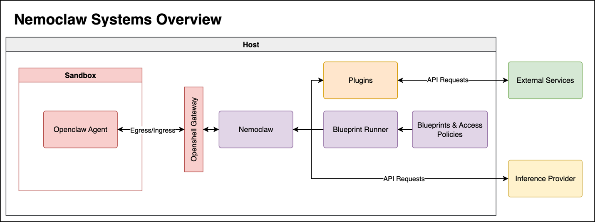

### Plugins

Plugins enable the agent to perform operations and access external services in a structured way. They are written using the Openclaw plugin standard, specified in the official Openclaw documentation. They are written in typescript, configured with a specific schema, and registered with the model provider to authorize its use.

- [Openclaw Plugin Documentation](https://docs.openclaw.ai/tools/plugin)
- Community plugins are published to Clawhub, which are less thoroughly audited.

| Item | Path |
| --- | --- |
| Sandbox name & inference provider | `~/.nemoclaw/config.yaml` |
| API keys | `~/.nemoclaw/credentials.json` |

### Inference Providers

Inference providers can be classified as local providers and remote services that charge a fee per-token. There are benefits and drawbacks to each and a combination can be used to leverage the cost-effectiveness of local inference with the higher-level reasoning and multimodal features of service-based solutions.

| Type | Providers |
| --- | --- |
| Local Inference | vLLM, NIM-Local, HuggingFace, Ollama |
| Remote Inference | Claude, OpenAI, Gemini, others |

| Command | Usage |
| --- | --- |
| Inference model status | `openshell inference status` |
| Registered credentials | `openshell provider list` |
| Switch model | `openshell inference set --provider <p> --model <m>` |

### Blueprints

Blueprints enable the user to configure:

a) How the sandbox environment is set up at creation
b) Access policies for egress/ingress and filesystem access, that can be hot-reloaded at runtime

| Item | Path |
| --- | --- |
| Blueprint configuration | `$(npm root -g)/nemoclaw/nemoclaw-blueprint/blueprint.yaml` |
| Blueprint engine | `$(npm root -g)/nemoclaw/src/blueprint/runner.ts` |
| Main policy configuration | `$(npm root -g)/nemoclaw/nemoclaw-blueprint/policies/openclaw-sandbox.yaml` |
| Example policies | `$(npm root -g)/nemoclaw/nemoclaw-blueprint/policies/presets/` |

### Sandbox Management

Once created, the user can manage active sandboxes, reload policies, view egress/ingress requests, and upload files. For example, because of the Openshell security layer, if an inference model requires physical files for analysis, these will need to either be configured one of two ways:

1. A database, with an appropriate egress policy, a registered plugin, and agent instructions of where/when/how to use the tool
2. Manually uploading the files to the `~/.openclaw-data/workspace/memory` directory within the sandbox using the `nemoclaw <sandbox-name> upload` command

| Command | Usage |
| --- | --- |
| View sandboxes | `openshell sandbox list` |
| View active policy | `openshell policy get <sandbox> --full` |
| View logs | `openshell logs <sandbox> --tail --source sandbox` |
| Open terminal UI | `openshell term` |

## Test Environment Setup

The procedure below provides you with instructions to install a minimal Nemoclaw environment on your Windows PC through WSL. It will be expanded on in subsequent sections of this report.

1. **Set up the environment**
   - Enable WSL2 in Windows Features and reboot
   - Install Ubuntu 22.04 LTS or later
   - Install Docker Desktop on host
   - Install npm, nodejs, and add to `$PATH`
   - Generate an NVIDIA API key and add it as an environment variable

2. **Install NemoClaw**
   - Open Ubuntu WSL2 in Terminal
   - `curl -fsSL https://nvidia.com/nemoclaw.sh | bash`
   - Run: `nemoclaw onboard`
   - Run: `nemoclaw sandbox list`
   - Run: `openshell policy get <sandbox-name> --full`
   - Run: `nemoclaw <sandbox-name> connect`
   - Run: `exit` - you will return to host

3. **Inspect Setup**
   - Run: `openshell logs <sandbox-name> --tail --source sandbox`
   - Run: `openshell term`
   - Inspect files from the configuration table above

## A Proposed Business Intelligence Platform

### Overview

In the Business Case section of this report, an opportunity was identified to leverage Nemoclaw in mitigating organizational risk, enhance productivity through context-driven responses provided by company procedures, quality standards, and any other functional documents, and lastly, the long-run strategy of reducing employee turnover impact on operations by consolidating the "tribal knowledge" of an organization into a series of agents that can be passed down from employee to employee.

As an example, there might be a mechanical designer agent with access to material ISO documents and customer specifications. There might be an applications agent, that has access to historical quotations and engineering designs that can be used to base future designs on. Finally, there could be an executive agent that is able to audit these business procedures, identify gaps, clarify ambiguity, and learn from situations that arise.

A simple but effective business intelligence system can be built with the following components:

| Component | Description |
| --- | --- |
| QMS Documents | The policies and procedures that your organization operates by. |
| Historical Examples | Documents and files that outline how best to perform a specific task. |
| VectorDB | Provides the ability to quickly find the right files and procedures among thousands. |
| GraphDB | Enables the agent to traverse documents in a structure built on how documents relate to each other instead of which folder someone placed the document in at some point in time. |
| Inference Provider | Either a locally-run model through vLLM, NIM-local, or HuggingFace, or alternatively a trusted AI service with a reasonable per-API-key token budget. |
| Familiar User Interface | A chat interface that puts the power in the hands of the employee. |
| Role Specific Features | Tools to perform CRUD operations on a personal Kanban task board; process flow charts to enable managers to map out gaps in their business processes; search tools such as Exa.AI; email integration; MCP servers; external services such as GitHub CLI. |

### Data Preparation

Software development agent platforms are very good at building out data processing pipelines. Below, is a high-level document processing pipeline that can be built in a day by an intermediate software architect. Either a local embedding model or paid one can be used.

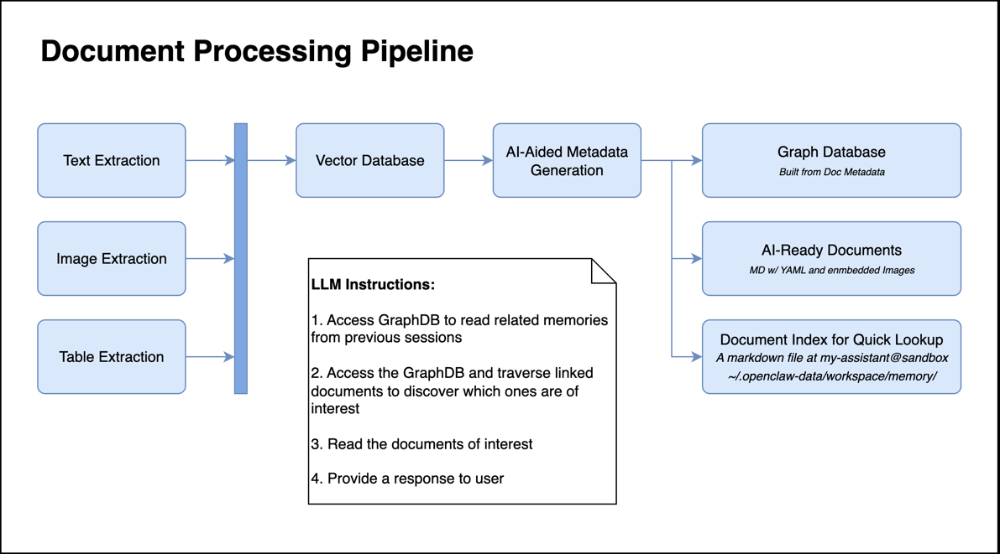

The processing pipeline above prepares the text data to be chunked, labelled, and linked for rapid recall by the agent with the goal of pointing it directly to the files that need to be accessed for more specific understanding.

### Deployment Procedure

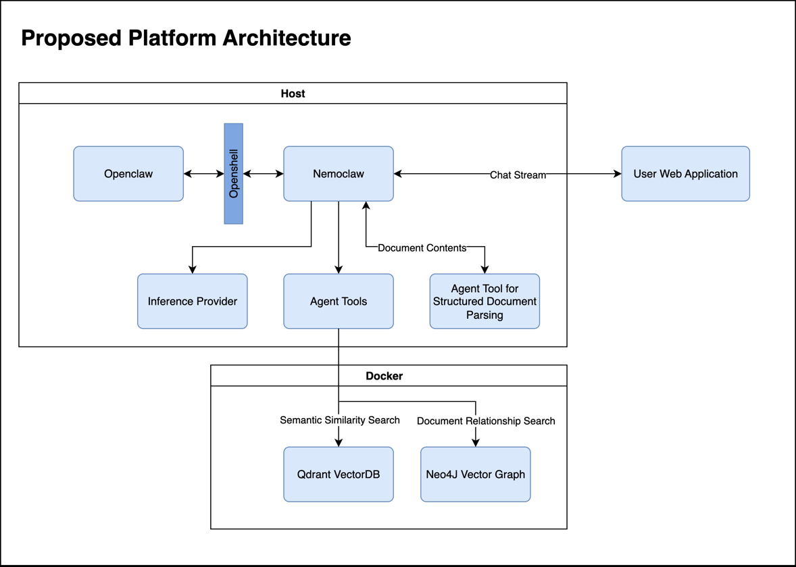

**1) Deploy Qdrant vector database as a Docker container**

```bash
docker run -d --name qdrant -p 6333:6333 -p 6334:6334 \
  -v qdrant_storage:/qdrant/storage qdrant/qdrant:latest
```

Then run a python script to upload chunks to Qdrant.

**2) Deploy Neo4j**

```bash
docker run -d --name neo4j -p 7474:7474 -p 7687:7687 \
  -v neo4j_data:/data -v neo4j_logs:/logs \
  -e NEO4J_AUTH=neo4j/neo4j123 \
  -e NEO4J_PLUGINS='["apoc"]' neo4j:latest
```

Then run a python script to upload all document metadata to Neo4j.

**3) Modify the Nemoclaw network policy to accept connections to Qdrant**

Append directly to `openclaw-sandbox.yaml` in `/root/.nemoclaw/source/nemoclaw-blueprint/policies/`. The configuration will look similar to:

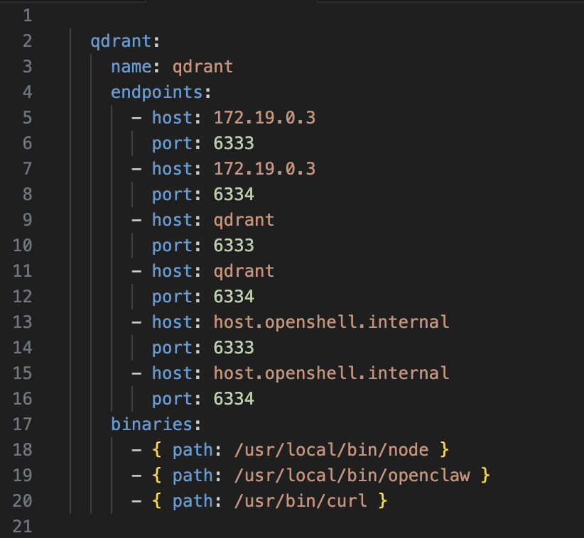

Then hot-reload the network policy:

```bash
nemoclaw <sandbox-name> policy-add
```

**4) Modify the Nemoclaw network policy to accept connections to Neo4j**

Append directly to `openclaw-sandbox.yaml` with a configuration similar to:

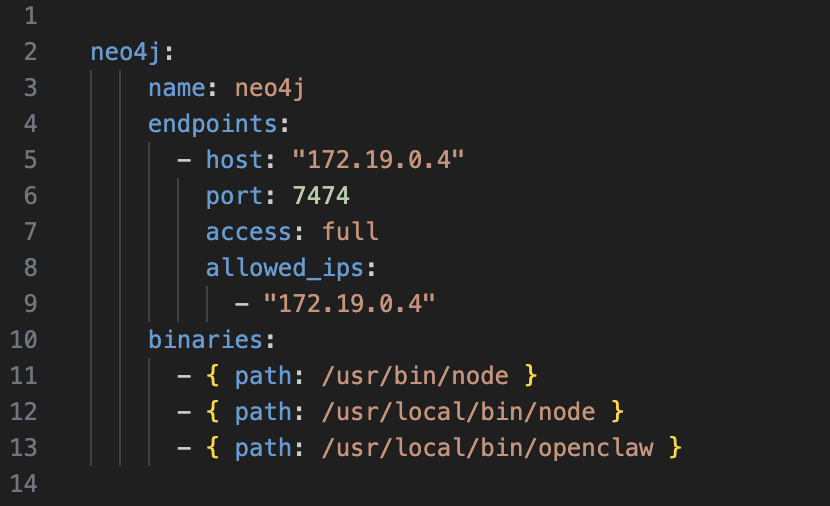

Then hot-reload the network policy:

```bash
nemoclaw <sandbox-name> policy-add
```

**5) Build the tools for the agent to access these services in a structured way**

Upload curl examples, Python scripts, or Typescript scripts to the sandbox in the `~/.openclaw-data/extensions` directory.

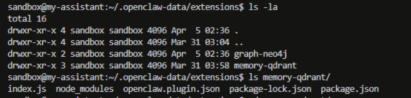

Inside of each tool folder, you must configure the plugin schema:

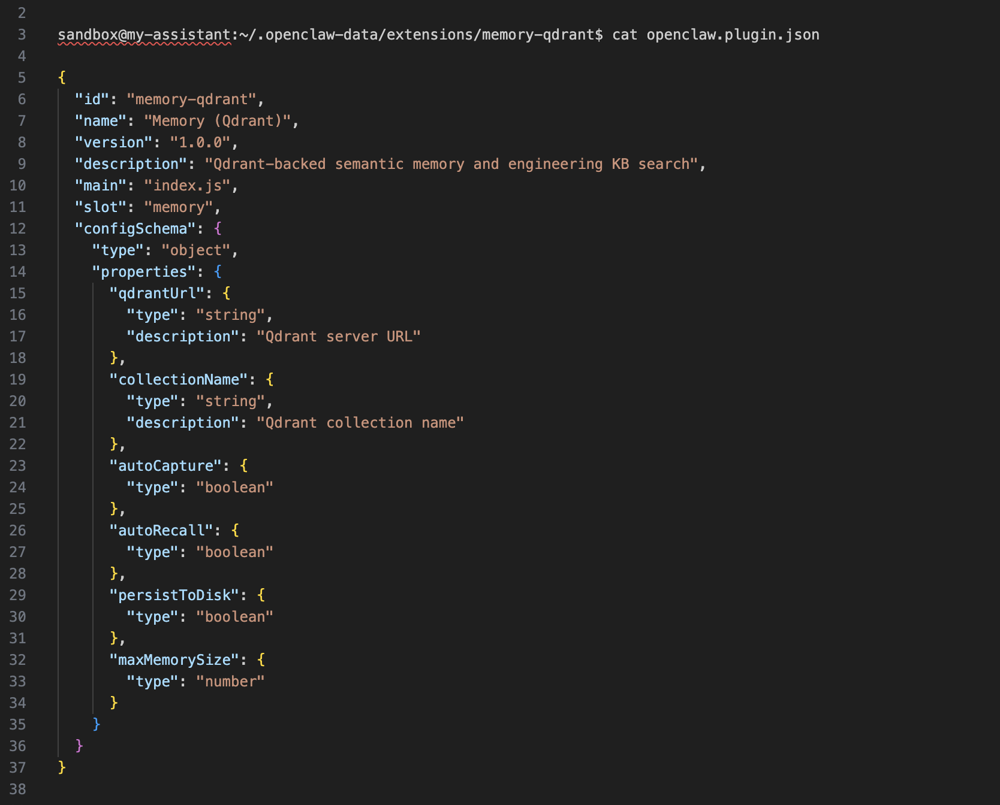

The `index.js` script MUST be written using the [Openclaw plugin API](https://docs.openclaw.ai/tools/plugin).

**6) Link all tools in the TOOLS.md file**

Upload a new `TOOLS.md` to the sandbox at `~/.openclaw` workspace:

```bash
nemoclaw <sandbox-name> upload
```

An entry will document tool usage, actions, and rules:

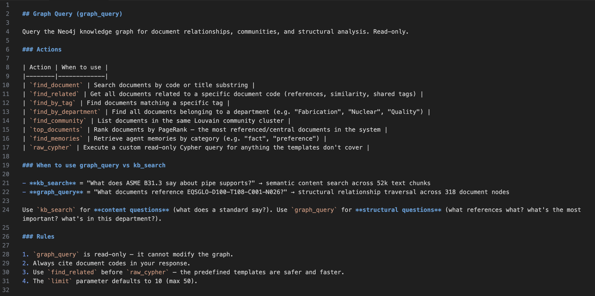

**7) Define a lookup strategy in either TOOLS.md or AGENT.md**

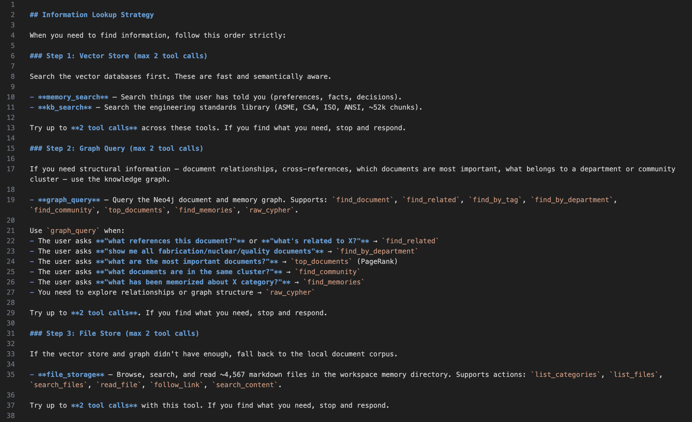

**8) Deploy a web application as a front-end interface to Nemoclaw**

- Socket streaming connection
- Configure a proxy on the host with `change_origin` enabled
- `openshell forward start -d 0.0.0.0:18789 <sandbox-name>`
- `openclaw gateway --bind lan`

**9) Verify web access**

In a web browser, access the Openclaw configuration page at `http://localhost:<web-app-port>/<endpoint-selected-in-proxy>`.

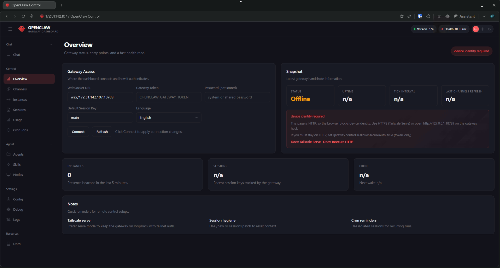

**10) Generate an SSL access token**

Generate a token and paste it in the Gateway Token field in the web-app and/or the Openclaw gateway access page:

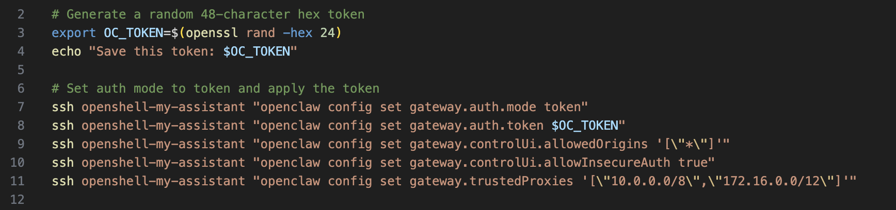

## Gaps

Due to how new the project is, there are no guides that outline complete Nemoclaw deployment in a corporation and through a platform provider such as Azure or AWS.

There is also very limited guidance on how to configure specific Nemoclaw systems, such as custom plugins, unique blueprint policies, and filesystem access.

It will be very interesting to see how the technology develops as more organizations begin working with it, and to measure its impact on business operations. Any claims that have been made, on the internet or otherwise, are largely untested yet.

## Conclusion

As an organization, it is vital that you have an AI policy, and that you have enough expertise and interest at the governance level to adapt to the changing technology landscape. AI has commoditized many white-collar roles. If you are not leveraging it, then your competitors are, and it is a matter of time until they are able to streamline operations, reduce cost of goods sold, deliver products to market quicker, and outcompete you. People may argue whether the timeline of change is 1 year, 5 years, or yesterday. It might depend on your industry, where you operate, and other factors. However, the necessity to adapt and risks of falling behind remain real, whatever that timeline is.

## References

- https://docs.nvidia.com/nemoclaw/latest/
- https://docs.nvidia.com/openshell/latest/
- https://nemoclawai.io/blog/
- https://deepwiki.com/NVIDIA/OpenShell
- https://deepwiki.com/NVIDIA/OpenShell/3-core-concepts
- https://deepwiki.com/NVIDIA/OpenShell/4-cli-reference
- https://docs.openclaw.ai/
