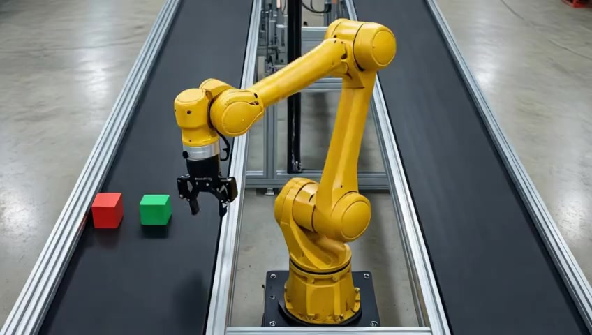
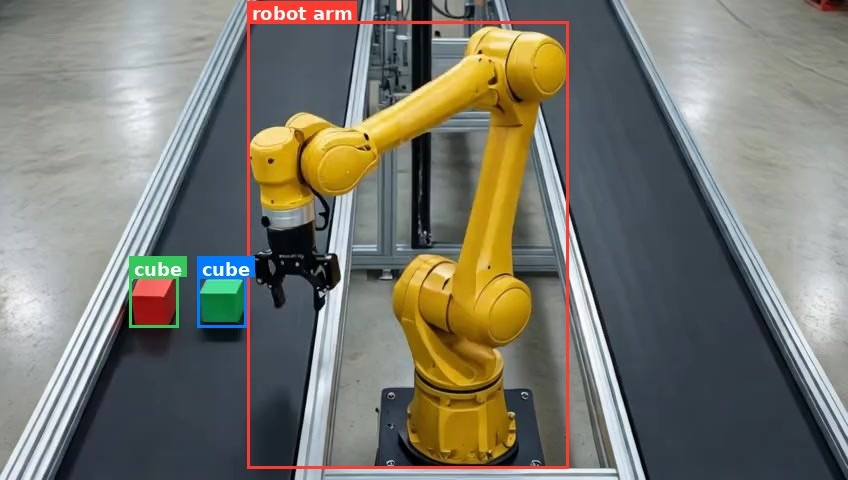
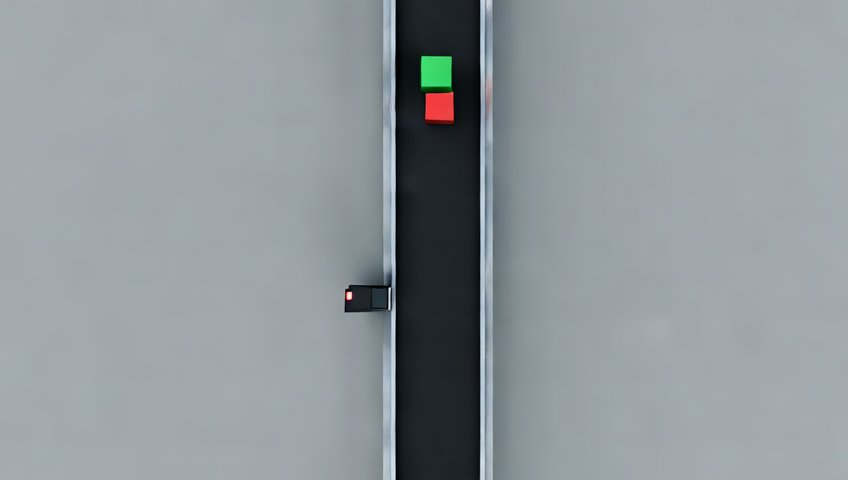
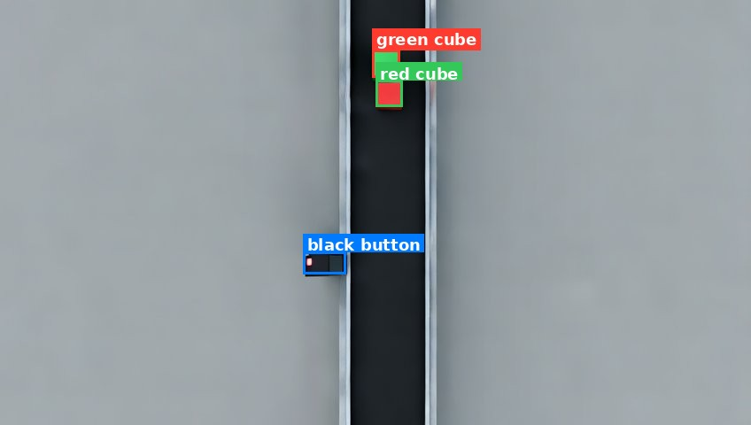

Cosmos is a family of vision large language models (vLLM's) developed by NVIDIA for their Physical AI ecosystem. The models, themselves, are designed to integrate with other NVIDIA products, such as:

**TAO** is NVIDIA's post-training framework that enables developers to specialize existing models for their specific use case.

**Metropolis** is NVIDIA's product which uses models trained using TAO to extract information from video feeds. These video feeds are typically either real video feeds, or simulated video feeds from NVIDIA's Omniverse product.

Many NVIDIA Physical AI products work together as building blocks to build AI systems that can reason about the real world. The role of cosmos is to bridge the gap between what is happening in real life, in a manufacturing environment, or autonomous vehicles, with software that can make decisions and act based on that inference.

There are 2 goals of Cosmos:

**Synthetic Data Generation** is generating new data based on existing data. Data can become a bottleneck in improving AI models if there is not enough data captured from specific situations. An example is an autonomous vehicle or manufacturing machine crashing. These situations are hopefully few and far between, so the situation is underrepresented when the AI model is trained. This results in a weaker ability for the AI model to understand these situations. In order to increase the amount of training data for these specific situations, synthetic data generation enables AI engineers to generate these edge-cases without needing to actually produce them.

**Understanding Physical Interactions** is the ability for an LLM with vision capabilities to reason about the environment in an image or video feed. It's the ability to segment different features, describe how they are positioned in 3D space, what the items might be, and how they are expected to interact together. A well documented case study is the ability of LLMs to reproduce reflections/refraction in water. Cosmos must use a sophisticated understanding of physics to be able to do this.

There are 3 functions of Cosmos:

**Reason** is the ability for an AI model to watch a video (image frames) and discern what is happening. This includes being able to identify objects in the scene, how they interact, and perform higher-level analysis on what is happening in the scene.

**Transfer** is the ability for an AI model to modify an existing video (image frames) based on a prompt for synthetic data generation. An example of this is taking a video of someone walking down a path and being able to generate a new video file based on different weather conditions, such as snow or rain. The LLM must be able to accurately simulate the physics of rain falling, the refraction of light in the scene, and how individual drops hit the ground.

**Predict** builds on the idea of transfer. It is the ability to generate new frames, "future" frames, in a video based on previous frames. The LLM must need a high degree of understand of what is happening in the scene and have enough context to reason about what is likely to happen in the moments after the video ends.

Prior to Cosmos 3, NVIDIAs flagship Physical AI model, Reason, Transfer, and Predict were all separate models that could be experimented with separately. However, Cosmos 3 introduced a set of multimodal models which integrate these three capabilities in one product.

Below is a list of Cosmos 3 products:

- Cosmos3-Nano
- Cosmos3-Super
- Cosmos3-Nano-Policy-DROID
- Cosmos3-Super-Image2Video
- Cosmos3-Super-Text2Image

Cosmos 3 Model: <https://huggingface.co/nvidia/Cosmos3-Nano>

Since I have an outdated GPU, I will be testing using a rented GPU on Vast.ai.

I created an instance for $0.472 per hour with an RTX 4080S.


```powershell
ssh-keygen
cat ~/.ssh/id_ed25519.pub | clip.exe
```

Paste the copied public key into the SSH Keys section of your Vast.ai account dashboard.


Add the same key to the container's SSH keys so you can connect to the running instance.


I used the following CUDA template for this container:
<https://cloud.vast.ai/?ref_id=5&creator_id=5&name=cuda%3A12.0.1-devel-ubuntu20.04>


```bash
curl -O https://repo.anaconda.com/miniconda/Miniconda3-latest-Linux-x86_64.sh
bash ./Miniconda3-latest-Linux-x86_64.sh
source ~/.bashrc

conda create --name cosmos-3-12 python=3.12
conda activate cosmos-3-12

scp -r -P <port> root@<host_ip>:/root/cosmos/ /<local_path>/
mkdir -p cosmos/examples
cd cosmos/examples
apt-get update && apt-get install -y libgl1-mesa-glx
```

Install the dependencies:

```text
# Cosmos3-Nano inference scripts — Python 3.13, Linux, NVIDIA GPU (BF16)
#
# torch/torchvision must match your CUDA driver. Install them with a backend-aware
# command rather than a bare `pip install -r`, e.g.:
#   uv pip install --torch-backend=auto -r requirements.txt
# or pin a wheel index:
#   pip install -r requirements.txt --extra-index-url https://download.pytorch.org/whl/cu130

# --- Core generation stack (scripts 00 & 01, local Diffusers path) ---
# Cosmos3 needs diffusers from main; it is not in a tagged release yet.
diffusers @ git+https://github.com/huggingface/diffusers.git
transformers
accelerate
torch
torchvision

# Media I/O + video export
av
imageio
imageio-ffmpeg

# Video reasoning / vision-language model (script 05)
qwen-vl-utils

# Model download (script 00) and safety guardrail (required by the license)
huggingface_hub[hf_transfer]
cosmos_guardrail
```

```bash
pip install -r requirements.txt
```

Enable token access to public gated repo's.


```bash
export HF_TOKEN=<hf_token>
hf auth login --token <hf_token>
```

# Experiments

Two end-to-end pipelines demonstrate Cosmos 3 **Reason**, **Transfer**, and **Predict** on factory scenes. Each lives under `examples/` and runs the same six steps: text-to-image, image grounding, image-to-video, video reasoning, video transfer (revision), and future-frame prediction.

Scripts are numbered `1_` through `6_`. Run from the example directory so outputs land in `output/`.

```bash
source "$(conda info --base)/etc/profile.d/conda.sh"
conda activate cosmos-3-12
cd examples/<robot_example|actuator_example>
for i in 1 2 3 4 5 6; do python "${i}"_*.py || exit 1; sleep 30; done
```

Navigate to the HuggingFace page for a model.


## Robot Example

A yellow 6-axis robot arm picks blocks from a left conveyor and places them on a right conveyor. The pipeline exercises synthetic scene generation, object grounding, manipulation video, reasoning, transfer, and prediction.

| Step | Script | Capability |
|------|--------|------------|
| 1 | `1_text_to_image.py` | Text → image |
| 2 | `2_segment_image.py` | Reason (bounding boxes) |
| 3 | `3_image_to_video.py` | Image → video (Transfer) |
| 4 | `4_inference_video.py` | Reason (video description) |
| 5 | `5_video_revision.py` | Video transfer |
| 6 | `6_video_future_frames.py` | Predict (future frames) |

### Demo 1: Image Generation

Input: a text prompt. Output: a generated image.

```python
import os
os.environ["PYTORCH_CUDA_ALLOC_CONF"] = "expandable_segments:True"

import torch
from diffusers import Cosmos3OmniPipeline

pipe = Cosmos3OmniPipeline.from_pretrained("nvidia/Cosmos3-Nano", torch_dtype=torch.bfloat16, enable_safety_checker=False)
pipe.enable_sequential_cpu_offload()

prompt = (
    "High-angle 45-degree downward shot of a yellow 6-axis robotic arm with a black steel "
    "parallel-jaw finger gripper in the open position, hovering above the left conveyor at a short distance ready to pick up a block. The robot base is mounted on the floor in the gap between two perfectly "
    "parallel black conveyor belts extending beyond the edges of the frame on both ends, entire robot "
    "body from base to gripper fully visible in frame. Square red and "
    "green blocks sit on the left belt, small enough to fit inside the robot gripper. The right "
    "belt is empty. Polished concrete factory floor, overhead LED lighting, even illumination, "
    "no shadows. Real photograph taken with a DSLR camera, photorealistic, ultra-realistic, "
    "not a render, not CGI, not 3D, real factory, real robot, sharp focus, 8k, high detail."
)

result = pipe(prompt, num_frames=1, height=720, width=1280, num_inference_steps=35)
image = result.video[0]
os.makedirs("output", exist_ok=True)
image.save("output/1.jpg", format="JPEG", quality=85)
print("Saved output/1.jpg")
```

Output:



### Demo 2: Image Grounding (Bounding Boxes)

Input: an image. Output: an annotated image with bounding boxes and a chain-of-thought text file.

This demo uses the Cosmos3-Nano Reasoner to locate and label every object in the scene. The model returns bounding box coordinates in JSON format, which are then drawn onto the image.

```python
import os
os.environ["PYTORCH_CUDA_ALLOC_CONF"] = "expandable_segments:True"

import json
import re

import torch
from PIL import Image, ImageDraw, ImageFont
from transformers import AutoProcessor, Cosmos3OmniForConditionalGeneration

image_path = "output/1.jpg"

model = Cosmos3OmniForConditionalGeneration.from_pretrained(
    "nvidia/Cosmos3-Nano", torch_dtype=torch.bfloat16, device_map="auto"
)
processor = AutoProcessor.from_pretrained("nvidia/Cosmos3-Nano")

messages = [
    {
        "role": "user",
        "content": [
            {"type": "image", "image": image_path},
            {
                "type": "text",
                "text": (
                    "Locate every distinct object in this image. "
                    "For each object, output a JSON object with keys "
                    '"label" (short name) and "bbox_2d" [x_min, y_min, x_max, y_max] '
                    "where coordinates are relative values from 0 to 1000. "
                    "Return a JSON array of these objects, nothing else."
                ),
            },
        ],
    }
]

inputs = processor.apply_chat_template(
    messages,
    tokenize=True,
    add_generation_prompt=True,
    return_dict=True,
    return_tensors="pt",
).to(model.device)

output_ids = model.generate(**inputs, max_new_tokens=2048)
generated = [out[len(inp):] for inp, out in zip(inputs.input_ids, output_ids)]
response = processor.batch_decode(generated, skip_special_tokens=True)[0]

print("\n=== Raw Reasoning Output ===")
print(response)

os.makedirs("output", exist_ok=True)
with open("output/2_analysis.txt", "w") as f:
    f.write(response)
print("\nSaved output/2_analysis.txt")

# --- Parse bounding boxes from the response ---

def extract_boxes(text):
    """Try to parse a JSON array of {label, bbox_2d} objects from model output."""
    match = re.search(r"\[.*\]", text, re.DOTALL)
    if match:
        try:
            return json.loads(match.group())
        except json.JSONDecodeError:
            pass
    objects = []
    for m in re.finditer(
        r'"label"\s*:\s*"([^"]+)"[^}]*"bbox_2d"\s*:\s*\[([^\]]+)\]', text
    ):
        label = m.group(1)
        coords = [float(c.strip()) for c in m.group(2).split(",")]
        if len(coords) == 4:
            objects.append({"label": label, "bbox_2d": coords})
    return objects

objects = extract_boxes(response)

if not objects:
    print("\nNo bounding boxes parsed — saving raw analysis only.")
    raise SystemExit(0)

# --- Draw boxes onto the image ---

COLORS = [
    "#FF3B30", "#34C759", "#007AFF", "#FF9500", "#AF52DE",
    "#FFD60A", "#30D5C8", "#FF2D55", "#5AC8FA", "#FFCC00",
]

img = Image.open(image_path).convert("RGB")
w, h = img.size
draw = ImageDraw.Draw(img)

try:
    font = ImageFont.truetype("/usr/share/fonts/truetype/dejavu/DejaVuSans-Bold.ttf", 18)
except OSError:
    font = ImageFont.load_default()

for i, obj in enumerate(objects):
    label = obj.get("label", f"object_{i}")
    bbox = obj.get("bbox_2d", [])
    if len(bbox) != 4:
        continue

    x_min = bbox[0] / 1000 * w
    y_min = bbox[1] / 1000 * h
    x_max = bbox[2] / 1000 * w
    y_max = bbox[3] / 1000 * h

    color = COLORS[i % len(COLORS)]
    draw.rectangle([x_min, y_min, x_max, y_max], outline=color, width=3)

    text_bbox = font.getbbox(label)
    tw, th = text_bbox[2] - text_bbox[0], text_bbox[3] - text_bbox[1]
    label_y = max(y_min - th - 6, 0)
    draw.rectangle([x_min, label_y, x_min + tw + 8, label_y + th + 6], fill=color)
    draw.text((x_min + 4, label_y + 2), label, fill="white", font=font)

img.save("output/2.jpg", format="JPEG", quality=90)
print(f"\nDrew {len(objects)} bounding boxes → output/2.jpg")
```

Output:



### Demo 3: Image to Video

Input: an image and a prompt. Output: a generated video.

```python
import os
os.environ["PYTORCH_CUDA_ALLOC_CONF"] = "expandable_segments:True"

import torch
from diffusers import Cosmos3OmniPipeline
from diffusers.utils import export_to_video, load_image

image_path = "output/1.jpg"

pipe = Cosmos3OmniPipeline.from_pretrained(
    "nvidia/Cosmos3-Nano", torch_dtype=torch.bfloat16, enable_safety_checker=False
)
pipe.enable_sequential_cpu_offload()

prompt = "The robot uses its gripper to move the red block from the left conveyor to the right conveyor. Static camera. No new objects can enter the frame. Smooth motion."
image = load_image(image_path)

result = pipe(prompt, image=image, num_frames=80, height=480, width=848, fps=24.0, num_inference_steps=40)
os.makedirs("output", exist_ok=True)
export_to_video(result.video, "output/3.mp4", fps=24, macro_block_size=1)
print("Saved output/3.mp4")
```

Output:

<video controls width="640"><source src="/posts/698ed734-eeb6-41bf-b8cd-94ef7bdf9908/robot-3.mp4" type="video/mp4" /></video>

### Demo 4: Video Reasoning

Input: a video. Output: a text description of what is happening.

This demo uses the Cosmos3-Nano **Reasoner tower** — the autoregressive vision-language model inside the unified Cosmos3 architecture — to analyze a video and describe its contents. Unlike the previous demos which use the Generator tower via `Cosmos3OmniPipeline` (diffusers), this loads only the Reasoner via `Cosmos3OmniForConditionalGeneration` (transformers).

```python
import os
os.environ["PYTORCH_CUDA_ALLOC_CONF"] = "expandable_segments:True"

import torch
from transformers import AutoProcessor, Cosmos3OmniForConditionalGeneration

video_path = "output/3.mp4"

model = Cosmos3OmniForConditionalGeneration.from_pretrained(
    "nvidia/Cosmos3-Nano", torch_dtype=torch.bfloat16, device_map="auto"
)
processor = AutoProcessor.from_pretrained("nvidia/Cosmos3-Nano")

messages = [
    {
        "role": "user",
        "content": [
            {"type": "video", "video": video_path},
            {
                "type": "text",
                "text": (
                    "Describe in detail what is happening in this video. "
                    "Identify the objects, their movements, and any interactions between them."
                ),
            },
        ],
    }
]

inputs = processor.apply_chat_template(
    messages,
    tokenize=True,
    add_generation_prompt=True,
    return_dict=True,
    return_tensors="pt",
).to(model.device)

output_ids = model.generate(**inputs, max_new_tokens=512)
generated = [out[len(inp):] for inp, out in zip(inputs.input_ids, output_ids)]
response = processor.batch_decode(generated, skip_special_tokens=True)[0]

print("\n=== Video Analysis ===")
print(f"Video: {video_path}")
print(f"\n{response}")

os.makedirs("output", exist_ok=True)
with open("output/4_analysis.txt", "w") as f:
    f.write(response)
print("\nSaved output/4_analysis.txt")
```

Output: *Text output saved to `output/4_analysis.txt`.*

### Demo 5: Video Transfer

Input: a video and a new prompt. Output: a revised video.

```python
import os
os.environ["PYTORCH_CUDA_ALLOC_CONF"] = "expandable_segments:True"

import torch
import imageio.v3 as iio
from PIL import Image
from diffusers import Cosmos3OmniPipeline
from diffusers.utils import export_to_video

video_path = "output/3.mp4"

frames = iio.imread(video_path, plugin="pyav")
image = Image.fromarray(frames[0])

pipe = Cosmos3OmniPipeline.from_pretrained(
    "nvidia/Cosmos3-Nano", torch_dtype=torch.bfloat16, enable_safety_checker=False
)
pipe.enable_sequential_cpu_offload()

prompt = "A yellow robot arm picks up a green block from the left conveyor belt and places it on the right conveyor belt. Smooth motion."

result = pipe(prompt, image=image, num_frames=80, height=480, width=848, fps=24.0, num_inference_steps=40)
os.makedirs("output", exist_ok=True)
export_to_video(result.video, "output/5.mp4", fps=24, macro_block_size=1)
print("Saved output/5.mp4")
```

Output:

<video controls width="640"><source src="/posts/698ed734-eeb6-41bf-b8cd-94ef7bdf9908/robot-5.mp4" type="video/mp4" /></video>

### Demo 6: Video Predict

Input: a video and a prompt. Output: continued future frames.

```python
import os
os.environ["PYTORCH_CUDA_ALLOC_CONF"] = "expandable_segments:True"

import torch
import imageio.v3 as iio
from PIL import Image
from diffusers import Cosmos3OmniPipeline
from diffusers.utils import export_to_video

video_path = "output/5.mp4"

frames = iio.imread(video_path, plugin="pyav")
image = Image.fromarray(frames[-1])

pipe = Cosmos3OmniPipeline.from_pretrained(
    "nvidia/Cosmos3-Nano", torch_dtype=torch.bfloat16, enable_safety_checker=False
)
pipe.enable_sequential_cpu_offload()

prompt = "The robot arm returns to its starting position, hovering over the left conveyor. Static camera."

result = pipe(prompt, image=image, num_frames=49, height=480, width=848, fps=24.0, num_inference_steps=40)
os.makedirs("output", exist_ok=True)
export_to_video(result.video, "output/6.mp4", fps=24, macro_block_size=1)
print("Saved output/6.mp4")
```

Output:

<video controls width="640"><source src="/posts/698ed734-eeb6-41bf-b8cd-94ef7bdf9908/robot-6.mp4" type="video/mp4" /></video>

## Actuator Example

A top-down conveyor carries a green cube and a red cube from the top of the frame toward the bottom. A proximity sensor near the bottom of the belt detects the red cube. The pipeline demonstrates the same six Cosmos capabilities on a simpler actuator/sensor scene — useful for testing physical interactions like stop-on-detect vs. pass-through.

| Step | Script | Capability | Scenario |
|------|--------|------------|----------|
| 1 | `1_text_to_image.py` | Text → image | Cubes at top, sensor at bottom |
| 2 | `2_segment_image.py` | Reason (bounding boxes) | Same as Robot Example Demo 2 |
| 3 | `3_image_to_video.py` | Image → video | Cubes move down; sensor turns red and both stop |
| 4 | `4_inference_video.py` | Reason (video description) | Same as Robot Example Demo 4 |
| 5 | `5_video_revision.py` | Video transfer | Sensor does not respond; cubes keep moving |
| 6 | `6_video_future_frames.py` | Predict | Cubes continue down and exit frame |

### Demo 1: Image Generation

Input: a text prompt. Output: a generated image.

```python
import os
os.environ["PYTORCH_CUDA_ALLOC_CONF"] = "expandable_segments:True"

import torch
from diffusers import Cosmos3OmniPipeline

pipe = Cosmos3OmniPipeline.from_pretrained("nvidia/Cosmos3-Nano", torch_dtype=torch.bfloat16, enable_safety_checker=False)
pipe.enable_sequential_cpu_offload()

prompt = (
    "Direct top-down bird's-eye view of a single industrial conveyor belt running vertically "
    "from the top to the bottom of the frame. The conveyor has a black rubber belt and metal "
    "side rails. Static camera, entire conveyor fully visible in frame, no motion blur. "
    "At the very top of the belt, a green cube and a red cube sit centered on the conveyor, "
    "aligned along the belt direction. The green cube is positioned one foot upstream of the "
    "red cube (green at the top of the frame, red one foot below it moving toward the bottom). "
    "Both cubes are identical in size, square, and solid-colored. "
    "A small black rectangular opaque proximity sensor is mounted on the left side rail near the "
    "bottom of the frame, oriented to face upward along the belt toward approaching cubes. The sensor "
    "has a tiny red indicator LED in its top-left corner, currently unlit. "
    "Clean gray factory floor visible around the conveyor. Even overhead LED lighting, "
    "soft shadows, sharp focus. Photorealistic industrial photograph, high detail, not CGI."
)

result = pipe(prompt, num_frames=1, height=480, width=848, num_inference_steps=40)
image = result.video[0]
os.makedirs("output", exist_ok=True)
image.save("output/1.jpg", format="JPEG", quality=85)
print("Saved output/1.jpg")
```

Output:



### Demo 2: Image Grounding (Bounding Boxes)

Identical to **Robot Example Demo 2**. Run `2_segment_image.py` from `examples/actuator_example/`.

Output:



### Demo 3: Image to Video

Input: the generated image and a motion prompt. Output: cubes travel down the belt; when the red cube reaches the sensor, the LED turns red and both cubes stop.

```python
prompt = (
    "Static top-down bird's-eye camera, entire conveyor fully visible in frame, no camera movement. "
    "A single vertical conveyor belt with a black rubber surface and metal side rails runs from the "
    "top to the bottom of the frame, moving downward. A green cube and a red cube, identical in size, "
    "start at the very top of the belt centered on the conveyor. The green cube leads at the top and "
    "the red cube follows one foot below it, maintaining that fixed one-foot separation throughout. "
    "Both cubes always move at the same rate, locked together on the belt with no relative motion "
    "between them. They travel down at a constant shared speed from the top toward the bottom of the frame. "
    "A small black rectangular proximity sensor is mounted on the left side rail near the bottom of "
    "the frame, facing the belt. Its indicator LED in the top-left corner glows green while the cubes "
    "approach from above. When the red cube moves directly in front of the sensor near the bottom, "
    "the sensor responds: the LED changes from green to red. At the exact moment the light turns red, "
    "both cubes stop moving immediately and remain frozen in place on the belt. "
    "No new objects enter the scene. Only one green cube and one red cube exist. "
    "Even overhead factory lighting, photorealistic industrial video, smooth motion, no motion blur."
)

result = pipe(prompt, image=image, num_frames=80, height=480, width=848, fps=24.0, num_inference_steps=40)
```

Output:

<video controls width="640"><source src="/posts/698ed734-eeb6-41bf-b8cd-94ef7bdf9908/actuator-3.mp4" type="video/mp4" /></video>

### Demo 4: Video Reasoning

Identical to **Robot Example Demo 4**. Run `4_inference_video.py` from `examples/actuator_example/` against `output/3.mp4`.

Output: *Text output saved to `output/4_analysis.txt`.*

### Demo 5: Video Transfer

Input: first frame of `output/3.mp4` and a revised prompt. Output: cubes move down but the sensor does not respond — LED stays green, cubes pass through without stopping.

```python
prompt = (
    "Static top-down bird's-eye camera, entire conveyor fully visible in frame, no camera movement. "
    "A single vertical conveyor belt with a black rubber surface and metal side rails runs from the "
    "top to the bottom of the frame, moving downward. A green cube and a red cube, identical in size, "
    "start at the very top of the belt centered on the conveyor. The green cube leads at the top and "
    "the red cube follows one foot below it, maintaining that fixed one-foot separation throughout "
    "the entire clip. Both cubes always move at the same rate, locked together on the belt with no "
    "relative motion between them. They travel down at a constant uninterrupted shared speed from the "
    "top toward the bottom, never slowing, never stopping, and never reversing. "
    "A small black rectangular proximity sensor is mounted on the left side rail near the bottom of "
    "the frame, facing the belt. Its indicator LED in the top-left corner glows green throughout. "
    "When the red cube moves directly in front of the sensor near the bottom, the sensor does not "
    "respond: the LED stays green and does not change color. Both cubes continue moving down the belt "
    "together at the same constant shared rate without slowing or stopping, passing the sensor and "
    "traveling toward the bottom of the frame. "
    "No new objects enter the scene. Only one green cube and one red cube exist. "
    "Even overhead factory lighting, photorealistic industrial video, smooth continuous motion, "
    "no motion blur."
)

result = pipe(prompt, image=image, num_frames=140, height=480, width=848, fps=24.0, num_inference_steps=40)
```

Output:

<video controls width="640"><source src="/posts/698ed734-eeb6-41bf-b8cd-94ef7bdf9908/actuator-5.mp4" type="video/mp4" /></video>

### Demo 6: Video Predict

Input: last frame of `output/5.mp4` and a continuation prompt. Output: cubes keep moving down at the same rate until both exit below the frame.

```python
prompt = (
    "Static top-down bird's-eye camera, entire conveyor fully visible in frame, no camera movement. "
    "Continuation from the previous moment: a green cube and a red cube, identical in size, continue "
    "moving down a vertical conveyor belt with a black rubber surface and metal side rails that runs "
    "from the top to the bottom of the frame. The green cube leads and the red cube follows one foot "
    "below it, maintaining that fixed separation. Both cubes always move at the same rate, locked "
    "together on the belt with no relative motion between them. They keep moving down at the same "
    "constant shared speed as before, never slowing, never stopping, and never reversing. They travel "
    "downward toward the bottom of the frame until the red cube exits completely below the bottom "
    "edge, followed by the green cube, until both cubes are fully out of frame and only the empty "
    "conveyor belt remains visible. "
    "A small black rectangular proximity sensor mounted on the left side rail near the bottom of the "
    "frame has already been passed. Its indicator LED in the top-left corner remains green throughout. "
    "No new objects enter the scene. Only one green cube and one red cube exist. "
    "Even overhead factory lighting, photorealistic industrial video, smooth continuous motion, "
    "no motion blur."
)

result = pipe(prompt, image=image, num_frames=49, height=480, width=848, fps=24.0, num_inference_steps=40)
```

Output:

<video controls width="640"><source src="/posts/698ed734-eeb6-41bf-b8cd-94ef7bdf9908/actuator-6.mp4" type="video/mp4" /></video>
