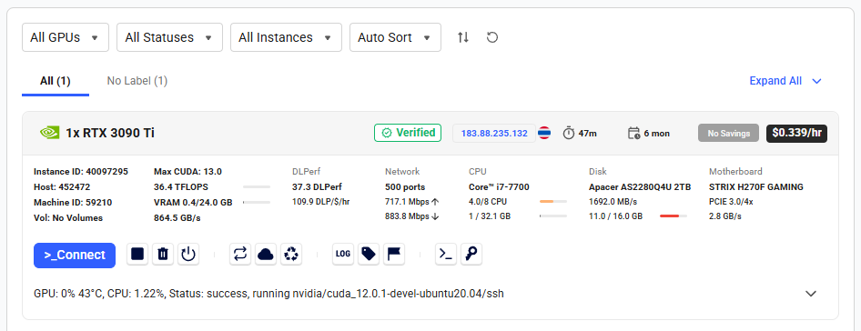
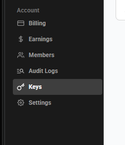
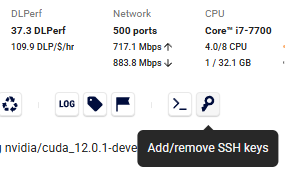
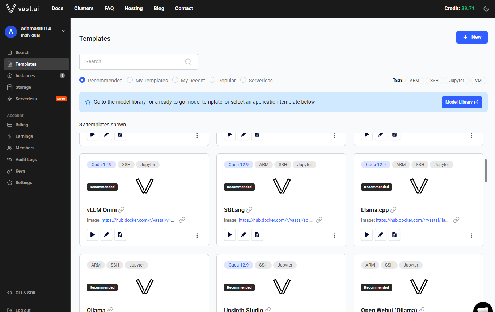
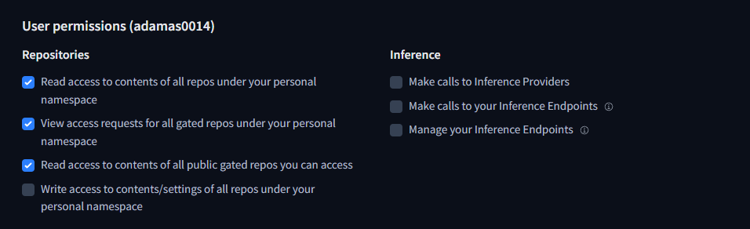
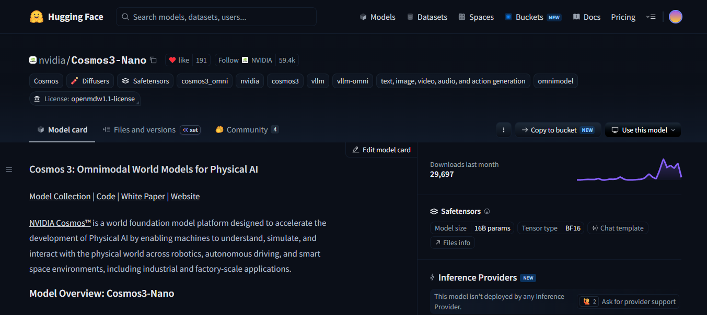
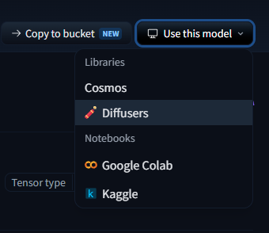
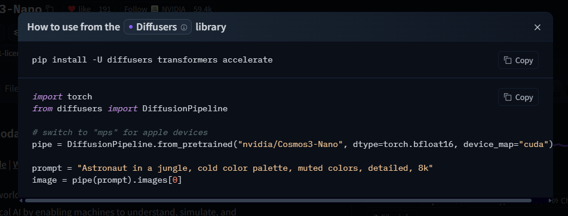

Cosmos is a family of vision large language models (vLLM's) developed by NVIDIA for their Physical AI ecosystem. The models, themselves, are designed to integrate with other NVIDIA products, such as:

**TAO** is NVIDIA's post-training framework that enables developers to specialize existing models for their specific use case.

**Metropolis** is NVIDIA's product which uses models trained using TAO to extract information from video feeds. These video feeds are typically either real video feeds, or simulated video feeds from NVIDIA's Omniverse product.

<br />

Many NVIDIA Physical AI products work together as building blocks to build AI systems that can reason about the real world. The role of cosmos is to bridge the gap between what is happening in real life, in a manufacturing environment, or autonomous car, with software that can make decisions and act based on that inference.

<br />

# Goals of Cosmos
There are 2 goals of Cosmos:
<br />

**1) Synthetic Data Generation** is generating new data based on existing data. Data can become a bottleneck in improving AI models if there is not enough data captured from specific situations. An example is an autonomous vehicle or manufacturing machine crashing. These situations are hopefully few and far between, so the situation is underrepresented when the AI model is trained. This results in a weaker ability for the AI model to understand these situations. In order to increase the amount of training data for these specific situations, synthetic data generation enables AI engineers to generate these edge-cases without needing to actually produce them.

**2) Understanding Physical Interactions** is the ability for an LLM with vision capabilities to reason about the environment in an image or video feed. It's the ability to segment different features, describe how they are positioned in 3D space, what the items might be, and how they are expected to interact together. A well documented case study is the ability of LLMs to reproduce reflections/refraction in water. Cosmos must use a sophisticated understanding of physics to be able to do this.

<br />

# Features of Cosmos

There are 3 features of Cosmos:
<br />

**1) Reason** is the ability for an AI model to watch a video (image frames) and discern what is happening. This includes being able to identify objects in the scene, how they interact, and perform higher-level analysis on what is happening in the scene.

**2) Transfer** is the ability for an AI model to modify an existing video (image frames) based on a prompt for synthetic data generation. An example of this is taking a video of someone walking down a path and being able to generate a new video file based on different weather conditions, such as snow or rain. The LLM must be able to accurately simulate the physics of rain falling, the refraction of light in the scene, and how individual drops hit the ground.

**3) Predict** builds on the idea of transfer. It is the ability to generate new frames, "future" frames, in a video based on previous frames. The LLM must need a high degree of understand of what is happening in the scene and have enough context to reason about what is likely to happen in the moments after the video ends.

Prior to Cosmos 3, NVIDIAs flagship Physical AI model, Reason, Transfer, and Predict were all separate models that could be experimented with separately. However, Cosmos 3 introduced a set of multimodal models which integrate these three capabilities in one product.

Below is a list of Cosmos 3 products:

- Cosmos3-Nano
- Cosmos3-Super
- Cosmos3-Nano-Policy-DROID
- Cosmos3-Super-Image2Video
- Cosmos3-Super-Text2Image

<br />

# Experiments

## Summary
Overall, the performance of the model, without any custom weights, was very underwhelming. For simpler mechanical mechanisms, like linear actuators, this model may be appropriate.

* Cosmos 3 Nano struggles with mechanical motions, often distoring rigid mechanical parts
* If motion instructions are detailed or contain more than one step, the output quality decreases significantly
* Processing is nowhere near real-time on moderate compute hardware


## Setup

Cosmos 3 Model: <https://huggingface.co/nvidia/Cosmos3-Nano>

Since I have an outdated GPU, I will be testing using a rented GPU on Vast.ai.

I created an instance for $0.472 per hour with an RTX 4080S.



```powershell
ssh-keygen
cat ~/.ssh/id_ed25519.pub | clip.exe
```

Paste the copied public key into the SSH Keys section of your Vast.ai account dashboard.



Add the same key to the container's SSH keys so you can connect to the running instance.



I used the following CUDA template for this container:
<https://cloud.vast.ai/?ref_id=5&creator_id=5&name=cuda%3A12.0.1-devel-ubuntu20.04>



```bash
curl -O https://repo.anaconda.com/miniconda/Miniconda3-latest-Linux-x86_64.sh
bash ./Miniconda3-latest-Linux-x86_64.sh
source ~/.bashrc

conda create --name cosmos-3-12 python=3.12
conda activate cosmos-3-12

scp
mkdir -p cosmos/examples
cd cosmos/examples
apt-get update && apt-get install -y libgl1-mesa-glx
```

Install the dependencies:

```text
# Cosmos3-Nano inference scripts — Python 3.13, Linux, NVIDIA GPU (BF16)
#
# torch/torchvision must match your CUDA driver. Install them with a backend-aware
# command rather than a bare `pip install -r`, e.g.:
#   uv pip install --torch-backend=auto -r requirements.txt
# or pin a wheel index:
#   pip install -r requirements.txt --extra-index-url https://download.pytorch.org/whl/cu130

# --- Core generation stack (scripts 00 & 01, local Diffusers path) ---
# Cosmos3 needs diffusers from main; it is not in a tagged release yet.
diffusers @ git+https://github.com/huggingface/diffusers.git
transformers
accelerate
torch
torchvision

# Media I/O + video export
av
imageio
imageio-ffmpeg

# Model download (script 00) and safety guardrail (required by the license)
huggingface_hub[hf_transfer]
cosmos_guardrail
```

```bash
pip install -r requirements.txt
```

Enable token access to public gated repo's.



```bash
export HF_TOKEN=<hf_token>
hf auth login --token <hf_token>
```

## Demo 1: Image Generation

Navigate to the HuggingFace page for a model.






Input: a text prompt. Output: a generated image.

```python
import os
os.environ["PYTORCH_CUDA_ALLOC_CONF"] = "expandable_segments:True"

import torch
from diffusers import Cosmos3OmniPipeline

pipe = Cosmos3OmniPipeline.from_pretrained("nvidia/Cosmos3-Nano", torch_dtype=torch.bfloat16)
pipe.enable_model_cpu_offload()

prompt = (
    "High-angle 45-degree downward shot of a yellow 6-axis robotic arm with a black steel "
    "parallel-jaw finger gripper in the open position, hovering above the left conveyor at a short distance ready to pick up a block. The robot base is mounted on the floor in the gap between two perfectly "
    "parallel black conveyor belts extending beyond the edges of the frame on both ends, entire robot "
    "body from base to gripper fully visible in frame. Square red and "
    "green blocks sit on the left belt, small enough to fit inside the robot gripper. The right "
    "belt is empty. Polished concrete factory floor, overhead LED lighting, even illumination, "
    "no shadows. Real photograph taken with a DSLR camera, photorealistic, ultra-realistic, "
    "not a render, not CGI, not 3D, real factory, real robot, sharp focus, 8k, high detail."
)

result = pipe(prompt, num_frames=1, height=720, width=1280, num_inference_steps=35)
image = result.video[0]
os.makedirs("output", exist_ok=True)
image.save("output/1.jpg", format="JPEG", quality=85)
print("Saved output/1.jpg")
```

Output:


## Demo 2: Image to Video

Input: an image and a prompt. Output: a generated video.

```python
import os
os.environ["PYTORCH_CUDA_ALLOC_CONF"] = "expandable_segments:True"

import torch
from diffusers import Cosmos3OmniPipeline
from diffusers.utils import export_to_video, load_image

image_path = "output/1.jpg"

pipe = Cosmos3OmniPipeline.from_pretrained(
    "nvidia/Cosmos3-Nano", torch_dtype=torch.bfloat16
)
pipe.enable_model_cpu_offload()

prompt = "The robot uses its gripper to move the red block from the left conveyor to the right conveyor. Static camera."
image = load_image(image_path)

result = pipe(prompt, image=image, num_frames=100, height=480, width=848, fps=24.0, num_inference_steps=40)
os.makedirs("output", exist_ok=True)
export_to_video(result.video, "output/2.mp4", fps=24, macro_block_size=1)
print("Saved output/2.mp4")
```

Output:

<video src="/posts/698ed734-eeb6-41bf-b8cd-94ef7bdf9908/2.mp4" controls width="640"></video>

## Demo 3: Video Transfer

Input: a video and a new prompt. Output: a revised video.

```python
import os
os.environ["PYTORCH_CUDA_ALLOC_CONF"] = "expandable_segments:True"

import torch
import imageio.v3 as iio
from PIL import Image
from diffusers import Cosmos3OmniPipeline
from diffusers.utils import export_to_video

video_path = "output/2.mp4"

frames = iio.imread(video_path, plugin="pyav")
image = Image.fromarray(frames[0])

pipe = Cosmos3OmniPipeline.from_pretrained(
    "nvidia/Cosmos3-Nano", torch_dtype=torch.bfloat16
)
pipe.enable_model_cpu_offload()

prompt = "A yellow robot arm picks up a green block from the left conveyor belt and places it on the right conveyor belt."

result = pipe(prompt, image=image, num_frames=100, height=480, width=848, fps=24.0, num_inference_steps=40)
os.makedirs("output", exist_ok=True)
export_to_video(result.video, "output/3.mp4", fps=24, macro_block_size=1)
print("Saved output/3.mp4")
```

Output:

<video src="/posts/698ed734-eeb6-41bf-b8cd-94ef7bdf9908/3.mp4" controls width="640"></video>

## Demo 4: Video Predict

Input: a video and a prompt. Output: continued future frames.

```python
import os
os.environ["PYTORCH_CUDA_ALLOC_CONF"] = "expandable_segments:True"

import torch
import imageio.v3 as iio
from PIL import Image
from diffusers import Cosmos3OmniPipeline
from diffusers.utils import export_to_video

video_path = "output/3.mp4"

frames = iio.imread(video_path, plugin="pyav")
image = Image.fromarray(frames[-1])

pipe = Cosmos3OmniPipeline.from_pretrained(
    "nvidia/Cosmos3-Nano", torch_dtype=torch.bfloat16
)
pipe.enable_model_cpu_offload()

prompt = "The robot arm returns to its starting position, hovering over the left conveyor. Static camera."

result = pipe(prompt, image=image, num_frames=49, height=480, width=848, fps=24.0, num_inference_steps=40)
os.makedirs("output", exist_ok=True)
export_to_video(result.video, "output/4.mp4", fps=24, macro_block_size=1)
print("Saved output/4.mp4")
```

Output:

<video src="/posts/698ed734-eeb6-41bf-b8cd-94ef7bdf9908/4.mp4" controls width="640"></video>

